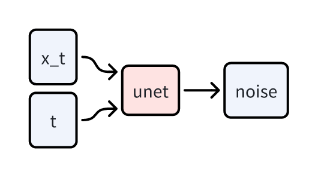

# unet-easy: an easy implementation of unet in diffusion models

UNet  gets $x_t$ (noisy image) and $t$ (time step) as input, and outputs $\epsilon_t$ (the noise in the image). 

<!-- smaller image -->


So we just can define the UNet class as follows:

```python
import torch.nn as nn
import torch


class UNET(nn.Module):
    def __init__(self):
        super().__init__()

    def forward(self, x, t):
        return x
```

Here are the inputs and outputs of the UNet:
- x `[batch_size, channels, height, width]` is the noisy image.
- t `[batch_size]` is the time step.
- x `[batch_size, channels, height, width]` in `return x` is the noise in the image.

We will use the following random input to test the UNet:

```python
if __name__ == "__main__":
    device = torch.device("cuda" if torch.cuda.is_available() else "cpu")
    x = torch.randn(2, 3, 224, 224).to(device)
    t = torch.randint(0, 100, (2,)).to(device)
    model = UNET().to(device)
    out = model(x, t)
    print(out.shape)

> torch.Size([2, 3, 256, 256])
```

The current output is `torch.Size([2, 3, 224, 224])`, which is the same shape as the input.

> Here, `to(device)` will bring obvious speedup todiffusion models, so I suggest you to add it even you are just testing the code.

Then we need to design the shape change in the UNet.

It is not easy to align the shape change between the downsample and upsample layers, so we need to design it carefully.

We won't get into too much details, but here is the general idea:

1. we use `conv_in` to make [2, 3, 224, 224] to [2, 64, 224, 224].
2. we use `downs` to downsample the feature map from [2, 64, 224, 224] to [2, 512, 28, 28].
3. we use `conv_mid` and does not change the shape [2, 512, 28, 28]
4. we use `ups` to upsample the feature map from [2, 512, 28, 28] to [2, 64, 224, 224].
5. we use `conv_out` to make [2, 64, 224, 224] to [2, 3, 224, 224].

The details of `downs`, `conv_mid` and `ups` are  a bit complex, we will talk about it later.

Now we can implement the UNet as follows:

```python
class UNET(nn.Module):
    def __init__(self, in_channels=3, n_channels=64):
        super().__init__()
        self.conv_in = nn.Conv2d(in_channels, n_channels, kernel_size=3, padding=1)
        self.conv_out = nn.Conv2d(n_channels, in_channels, kernel_size=1)

    def forward(self, x, t):
        x = self.conv_in(x)
        x = self.downs(x,t)
        x = self.conv_mid(x,t)
        x = self.ups(x,t)
        x = self.conv_out(x)
        return x
```

From the code above, we can see that we have added two convolutional layers `conv_in` and `conv_out`, which are both simple convolutional layers.

You can also notice we use the information of `t` in `downs`, `conv_mid` and `ups`, which are advanced blocks.

Now we will implement the `downs`.

`downs` have 4 layers.

If a tensor of [2, 64, 224, 224] passes through the `downs`, the process is:

1. [2, 64, 224, 224] -> block1 -> [2, 64, 224, 224] -> block2 -> [2, 64, 224, 224] -> downsample -> [2, 128, 14, 14]
2. ...
3. ...
4. ...

The `block1` and `block2` are `ResBlock`s, which we will implement later.

The `downsample` can be a simple pooling layer with kernel size 2 and stride 2.

Now we implement the `ResBlock`.

In the `ResBlock`, we use two convolutional layers with kernel size 3 and padding 1, and a skip connection.

```python
class ResBlock(nn.Module):
    def __init__(self, in_channels, out_channels):
        super().__init__()
        self.conv1 = nn.Conv2d(in_channels, out_channels, kernel_size=3, padding=1)
        self.conv2 = nn.Conv2d(out_channels, out_channels, kernel_size=3, padding=1)
        if in_channels != out_channels:
            self.shortcut = nn.Conv2d(in_channels, out_channels, kernel_size=1)
        else:
            self.shortcut = nn.Identity()

    def forward(self, x, t):
        x0 = x
        x = self.conv1(x)
        x = self.conv2(x)
        x = x + self.shortcut(x0)
        return x
```
For simplicity, we won't add norm layers, dropout layers or activation functions those doesn't change the shape of the feature map.

You can notice here we don't use `t` in `ResBlock`, we will talk about it later. For now, we just skip it for simplicity.

For Downsample, there are different ways to implement it, but we will use the simplest one:

```python
class Downsample(nn.Module):
    def __init__(self, in_channels, out_channels):
        super().__init__()
        self.conv = nn.Conv2d(in_channels, out_channels, kernel_size=3, padding=1)
        self.pool = nn.AvgPool2d(kernel_size=2, stride=2)

    def forward(self, x, t):
        x = self.conv(x)
        x = self.pool(x)
        return x
```

Now we can add ResBlocks and Downsample to the `downs`.

```python
class UNET(nn.Module):
    def __init__(self, img_channels=3, n_channels=64, chs=[1, 2, 4, 8]):
        super().__init__()
        self.conv_in = nn.Conv2d(img_channels, n_channels, kernel_size=3, padding=1)
        self.conv_out = nn.Conv2d(n_channels, img_channels, kernel_size=1)
        self.downs = nn.ModuleList()
        in_channels = n_channels
        for i in range(len(chs)):
            out_channels = n_channels * chs[i]
            self.downs.append(ResBlock(in_channels, in_channels))
            self.downs.append(ResBlock(in_channels, in_channels))
            self.downs.append(Downsample(in_channels, out_channels))
            in_channels = out_channels
```

Then we need to modify the `forward` function to use `downs`.

```python
def forward(self, x, t):
    x = self.conv_in(x)
    for i in range(len(self.downs)):
        x = self.downs[i](x, t)
    x = self.conv_mid(x, t)
    x = self.ups(x, t)
    x = self.conv_out(x)
    return x
```

Here we need to modify the `downs`.

There are 4 layers in `downs`, but there are only 3 Downsample layers.

The last layer doesn't change the size of the feature map.

```python

class UNET(nn.Module):
    def __init__(self, img_channels=3, n_channels=64, chs=[1, 2, 4, 8]):
        super().__init__()
        self.conv_in = nn.Conv2d(img_channels, n_channels, kernel_size=3, padding=1)
        self.conv_out = nn.Conv2d(n_channels, img_channels, kernel_size=1)
        self.downs = nn.ModuleList()
        in_channels = n_channels
        for i in range(len(chs)):
            out_channels = n_channels * chs[i]
            self.downs.append(ResBlock(in_channels, in_channels))
            self.downs.append(ResBlock(in_channels, in_channels))
            if i < len(chs) - 1:
                self.downs.append(Downsample(in_channels, out_channels))
            else:
                self.downs.append(
                    nn.Conv2d(in_channels, out_channels, kernel_size=3, padding=1)
                )
            in_channels = out_channels
```

The downs are implemented.

The Next is very important, we need to implement the `ups`.

The shape change should be designed carefully and it's not easy to align the shape change between the downsample and upsample layers.

Recall the change of channels and size in downsample is:
- channels: 64 -> 64 -> 128 -> 256 -> 512
- size:  224 -> 112 -> 56 -> 28 -> 28

The general idea is: the output of down layer 4 will be concatenated with the output of down layer 3. Because they have sample size of feaure map (28x28).

If a tensor of [2, 512, 28, 28] passes through the `ups`, the process is:

[2, 512, 28, 28] -> concat -> [2, 512 + 256, 28, 28] -> block1 -> [2, 512, 28, 28] -> concat -> [2, 512 + 256, 28, 28] -> block2 -> [2, 512, 28, 28] -> upsample -> [2, 256, 56, 56]

Now we implement the `ups`.

First, we need to implement Upsample.

```python
class Upsample(nn.Module):
    def __init__(self, in_channels, out_channels):
        super().__init__()
        self.conv = nn.ConvTranspose2d(
            in_channels, out_channels, kernel_size=2, stride=2
        )

    def forward(self, x, t):
        x = self.conv(x)
        return x
```


Then we implement the `ups`.

```python
self.ups = nn.ModuleList()

for i in reversed(range(len(chs))):
    ch_ind = len(chs) - i - 1
    out_channels = n_channels * chs[ch_ind - 1]
    self.ups.append(ResBlock(in_channels + out_channels, in_channels))
    self.ups.append(ResBlock(in_channels + out_channels, in_channels))

    if i > 0:
        self.ups.append(Upsample(in_channels, out_channels))
    else:
        self.ups.append(
            nn.Conv2d(in_channels, img_channels, kernel_size=3, padding=1)
        )
```

Then we add the `ups` to the `forward` function.


