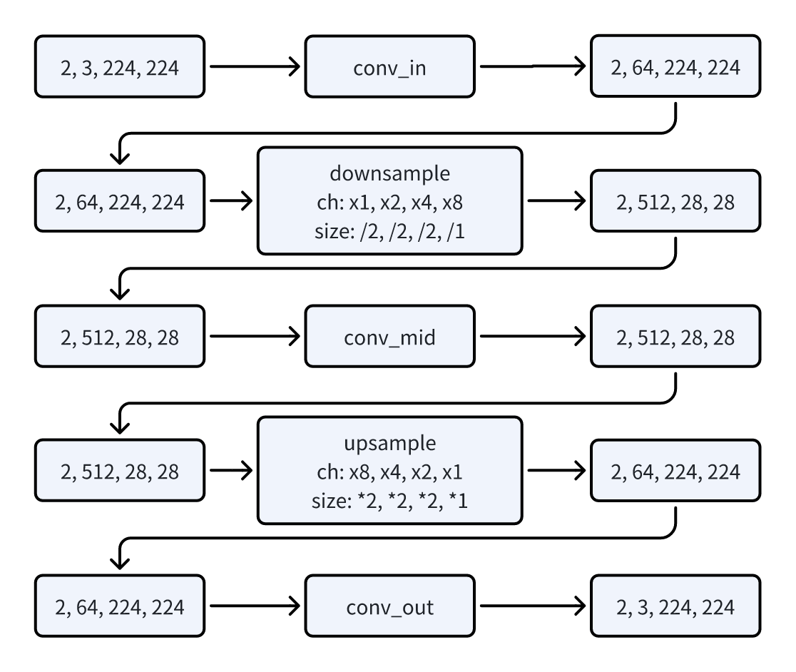
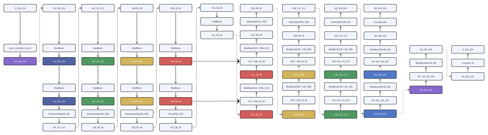

# unet-easy: an easy implementation of unet in diffusion models

UNet  gets $x_t$ (noisy image) and $t$ (time step) as input, and outputs $\epsilon_t$ (the noise in the image). 

<!-- smaller image -->


So we can define the UNet as follows:

```python
import torch.nn as nn
import torch


class UNET(nn.Module):
    def __init__(self):
        super().__init__()

    def forward(self, x, t):
        return x
```

Here are the inputs and outputs of the UNet:
- x is the noisy image of shape `[batch_size, channels, height, width]`.
- t is the time step of shape`[batch_size]`.
- x in `return x` is the noise in the image of same shape as x.

We will use the following random input to test the UNet in the process of implementation:

```python
if __name__ == "__main__":
    device = torch.device("cuda" if torch.cuda.is_available() else "cpu")
    x = torch.randn(2, 3, 224, 224).to(device)
    t = torch.randint(0, 100, (2,)).to(device)
    model = UNET().to(device)
    out = model(x, t)
    print(out.shape)
```

The current output is `torch.Size([2, 3, 224, 224])`, which is the same shape as the input.

Then we need to design the shape change in the process of the UNet.




第一步，整体结构。

一张 [3, 224, 224] 的图片进入 unet。

unet 的输出也应该是 [3, 224, 224]。
一张 3, 224, 224]


<!-- unet -->
